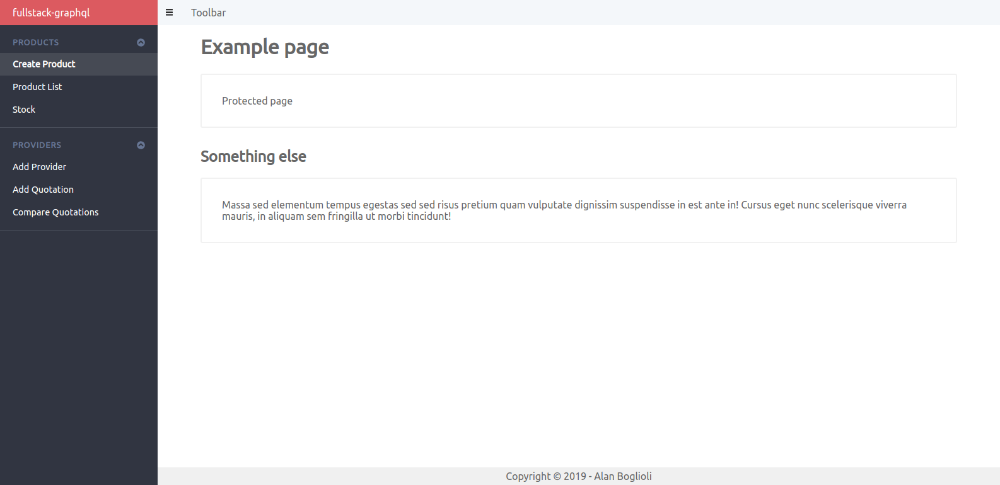

# Node < GraphQL > React boilerplate project

Boilerplate project to start easily a project using Node, GraphQL and React.

It includes **backend** and **frontend** code.

## Backend

- **Node**: platform.
- **Docker**: to run database services.
- **graphql-yoga**: GraphQL server.
- **Sequelize**: best ORM for relational databases (PostgreSQL, MySQL, MariaDB,
  etc.).
- **Mongoose**: ODM for MongoDB, with schemas support.
- **Redis**: key-value database.
- **Jest**: unit and integration testing.

Code is well structured and organized to be modular. You can add models and
modules (*GraphQL schemas and resolvers*) easily.

## Frontend

- **React**: UI library. With hooks support!
- **react-apollo**: GraphQL library for React.
- **react-router**.
- **FontAwesome**: for icons.
- **Basic dashboard structure**: made with CSS Grid, FontAwesome and react-router.



## Test

There are some helpers in `backend/tests/` to run tests. Some integration tests
have been written to show how easy is to set up the environment for testing.

Each test starts a new instance of GraphQLServer and make a new connection to
each DB (Sequelize and Redis use *mock* libraries, mongo makes real connections,
an running instance is needed). And each test uses an empty database with a
*prefix*.

For example, if I want to test User related things like models and resolvers, a
new connection to mongo will be made and all the data will be stored in
`database-test-user`. Testing Post all the data will be stored in
`database-test-post`.

# How to use

The **frontend** is ready to be used.

**Backend** requires some extra configuration.

First of all, [Sequelize](http://docs.sequelizejs.com/) and
[Mongoose](https://mongoosejs.com/docs/) have been used as ORMs for PostgreSQL
and Mongo. In `backend/src/db.js` there is a wrapper over `db-sequelize` and
`db-mongo`. By default both libraries are used and two connections are made: one
to a PostgreSQL instance and one to a MongoDB instance. In
`backend/src/config.js` you can configure which library to use, setting
`useSequelize` and `useMongo` respectively.

Models are loaded into `models` object of `db.js` and they are passed in context
to be available inside each resolver of the application.

In `models` you will have both models of Sequelize and Mongoose. So be careful
about what method to call. There is a little example about User, Post and
Category.

A DataLoader for Sequelize has been configured too. It improves perfomance when
there are subsequent queries.

## Set up the databases

The entire environment can run on Docker. It's recommended.

Each service can be set up from *docker-compose* configuration files. There is
three files to start containers of: **mongo**, **postgres** and **redis**. The
necessary visual managers (GUI) will be started for each service:
*mongo-express* to manage mongo, *pgadmin* to manage PostgreSQL and
*redis-commander* to manage Redis. The three managers are web based.

```
# Starting all the services
docker-compose \
  -f docker-compose.mongo.yml \
  -f docker-compose.postgres.yml \
  -f docker-compose.redis.yml
  up -d
```

For example, if you only need mongo and redis, you can run:

```
docker-compose \
  -f docker-compose.mongo.yml \
  -f docker-compose.redis.yml
  up -d
```

And set `useSequelize` as *false* in `backend/src/config.js`.
